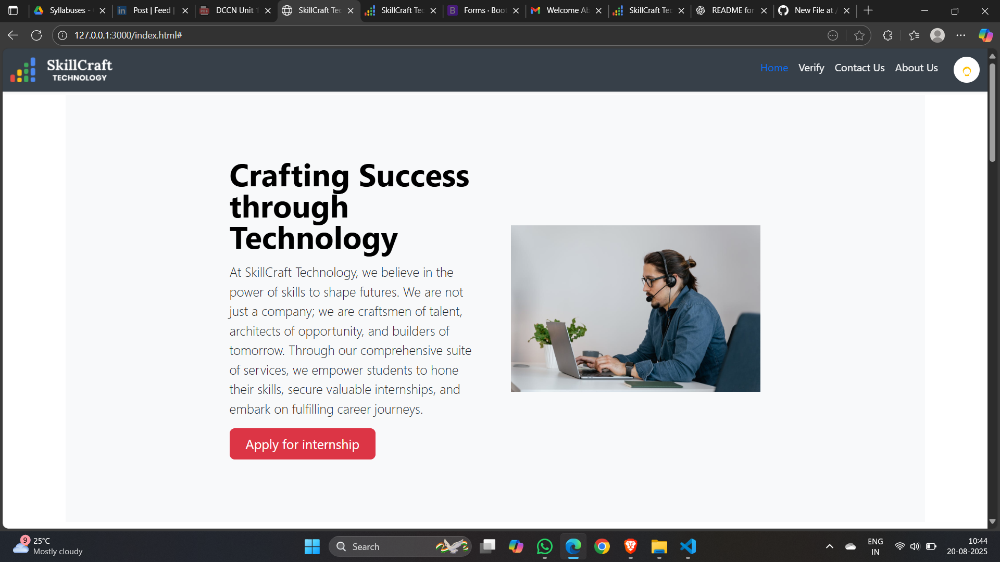

# 🌐 SkillCraft Technology Website

### Drive Through the Lane of Success 🚀

---

## 📌 Overview
The **SkillCraft Technology Website** is a responsive and modern landing page built with **HTML, CSS, Bootstrap 5, and JavaScript**.  
It highlights internship opportunities at SkillCraft Technology with a clean UI, dark/light mode toggle, and multiple sections like features, internships, and contact details.

---

## 🖼️ Project Screenshot

---

## 🔥 Features

- ✅ Responsive **Bootstrap 5** design
- ✅ Fixed **navbar** with logo & navigation links
- ✅ **Dark/Light Mode Toggle** with custom icons
- ✅ Internship program cards with **Apply buttons**
- ✅ Features showcase with custom icons
- ✅ Contact section with form & social media links
- ✅ Clean **footer** with quick links and copyright

---

## 📂 Project Structure

📁 SkillCraft-Website
│── index.html # Main HTML file
│── style.css # Custom CSS styles
│── script.js # JavaScript for theme toggle
│── asserts/ # Images and icons

---

## 🖼️ Preview

### 🔹 Navbar + Hero Section
- Fixed navbar with logo & theme toggle
- Hero banner with heading, description & CTA button

### 🔹 Internships Section
- Cards for multiple internship programs:
  - Software Development
  - Web Development
  - App Development
  - Machine Learning
  - Data Science
  - Cyber Security
  - Graphics Design
  - Digital Marketing
  - UI/UX

### 🔹 Features Section
- Verified Certificates
- High-Quality Content
- Hands-on Experience

### 🔹 Contact Section
- Contact form with Name, Email, Subject, Message
- Social Media Links (LinkedIn, Instagram, Twitter)  
⚠️ *Note: Contact Form is frontend-only (no backend integration).*

### 🔹 Footer
- Logo & tagline
- Quick Links
- Internship categories
- Address

### 🌑 Dark/Light Mode
- ☀️ Light Mode – Sun icon (yellow)
- 🌙 Dark Mode – Moon icon (blue)
- Implemented using **JavaScript + CSS overrides**

---

## ⚙️ Tech Stack

- **HTML5** – Markup structure
- **CSS3** – Custom styling
- **Bootstrap 5.3.7** – Responsive framework
- **JavaScript (Vanilla JS)** – Theme toggle interactivity

---

## 🚀 Getting Started

Clone the repository
git clone https://github.com/Pawar-Sudharshan/SCT_TrackCode_TaskNumber.git

Open the project
cd SCT_TrackCode_TaskNumber/SCT_WD_1

Run
Open index.html in your browser

🔗 GitHub Link: [SkillCraft Technology Website Project](https://github.com/Pawar-Sudharshan/SCT_TrackCode_TaskNumber/tree/main/SCT_WD_1)

---

## 📜 License
This project is for **educational/demo purposes** under SkillCraft Technology.  
Feel free to learn, modify, and improve the code.

