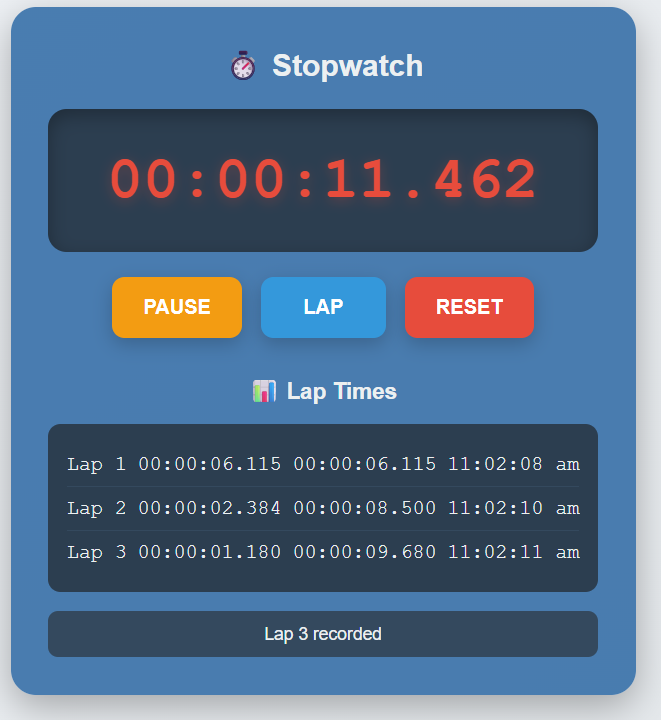

# Advanced Stopwatch - User Friendly

  <!-- Replace 'screenshot.jpg' with your actual image file -->

This is a user-friendly, advanced stopwatch web application built using **HTML**, **CSS**, and **JavaScript**. It features precise time tracking including start, pause, reset, and lap time recording with detailed statistics.
---
## Features
- **Start/Pause:** Toggle stopwatch running state with a single button
- **Reset:** Clear all recorded times and reset the stopwatch display
- **Lap Times:** Record individual lap times with timestamp and cumulative total
- **Real-time Display:** Time displayed with millisecond precision (HH:MM:SS.mmm)
- **Lap Statistics:** Displays the fastest, slowest, and average lap time
- **Keyboard Shortcuts:**  
  - Space: Start/Pause  
  - L: Record Lap  
  - R: Reset stopwatch
- **Responsive and clean UI:** Easy to use with a clean visual design
---
## How to Use
1. Open the `index.html` file in any modern web browser.
2. Click **START** to begin timing.
3. Click **LAP** to record lap times while the stopwatch is running.
4. Click **PAUSE** or hit the Space key to pause the stopwatch.
5. Click **RESET** or press the R key to reset the stopwatch and clear laps.
6. Lap times and statistics will be displayed below the controls.
---
## Files
- `index.html`: The main HTML file containing the stopwatch structure and links to external CSS and JS files.
- `style.css`: Contains all the styling rules for the application.
- `script.js`: Contains the JavaScript code handling stopwatch logic and UI updates.
---

## Code Overview
- The `Stopwatch` class manages timing, lap recording, and display updating.
- Uses `setInterval` to update the stopwatch display every 10 milliseconds.
- Lap times are stored in an array with lap number, individual lap time, total elapsed time, and timestamp.
- Statistics are calculated dynamically and displayed below the lap list.
- Button states and text update based on whether the stopwatch is running or paused.
---
## Browser Compatibility
- Compatible with all modern browsers (Chrome, Firefox, Edge, Safari).
- Fully responsive and works across desktop and mobile devices.
---
## Author
Pawar Sudharshan  
GitHub: [github.com/Pawar-Sudharshan](https://github.com/Pawar-Sudharshan)  
Email: [pawarsudharshan47@gmail.com](mailto:pawarsudharshan47@gmail.com)  
---
## License
This project is open source 
---
